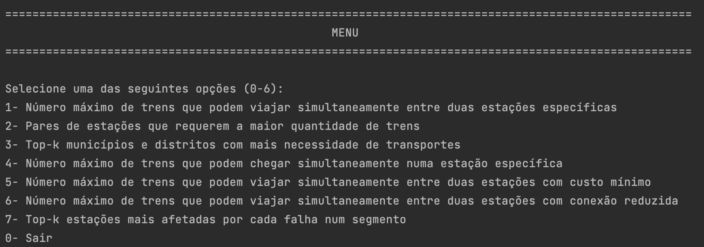
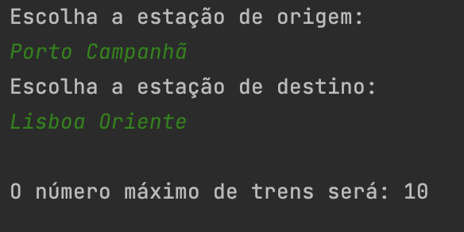
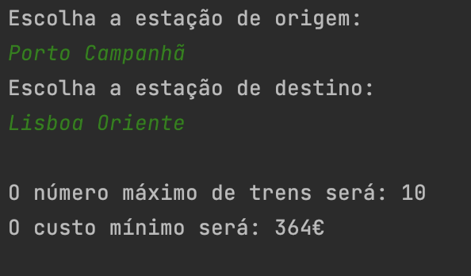
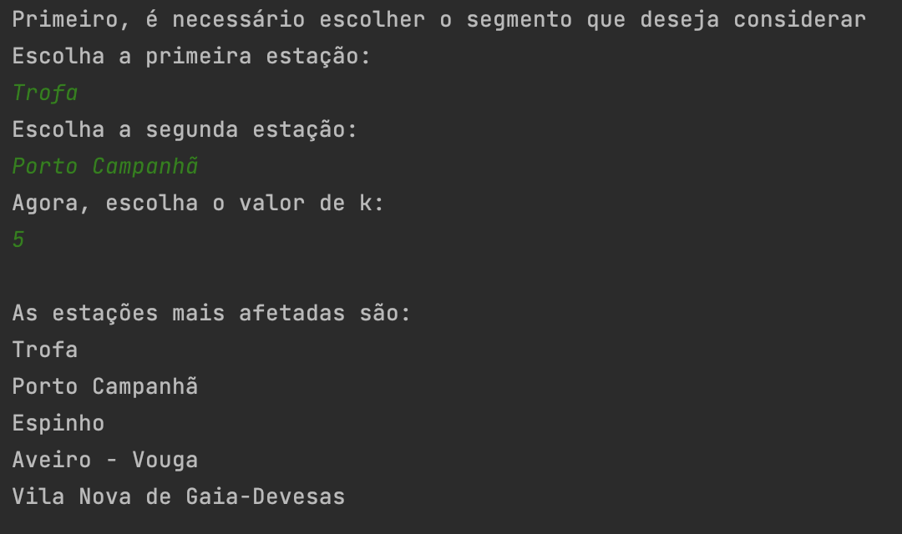

# Algorithm Design

## Railway Network

This project involves the development of an analysis tool designed to assist the management team of a railway network in making well-informed decisions regarding the optimal allocation of resources. These resources include both financial assets and physical assets, such as trains.  

In the context of a complex railway system, the management team faces multiple challenges when it comes to the efficient utilization of its resources. This tool will leverage a realistic dataset to provide insights and support decision-making in key areas such as:

* **Train Assignment**: How to efficiently allocate selected trains to different railway lines to meet demand.
* **Revenue Maximization**: How to optimize revenue when offering multiple levels of service (e.g., economy, first class).
* **Network Resilience**: Identifying critical sections of the network that are more vulnerable to failures in order to anticipate potential service disruptions or mitigate their impact.

By integrating various analysis functions, this tool will enable the management to enhance operational efficiency, maximize profitability, and ensure greater network reliability.

## Implemented Features

**Basic Service Metrics**:

* Maximum number of trains between two specific stations
* Pairs of stations that require the most amount of trains
* Top k municipalities and/or districts that require the most amount of trains
* Maximum number of trains that can arrive simultaneously at a specific station

**Operation Cost Optimization**:

* Maximum number of trains that can travel simultaneously between two stations with minimum cost

**Reliability and Sensitivity to Line Failures**:

* Maximum number of trains that can travel simultaneously between two stations with reduced connection
* Top-k stations most affected by each failure in a segment

> ### Main Menu

> ### Maximum number of trains between two stations

> ### Minimum cost

> ### Top-k stations most affected by a failure in a segment

